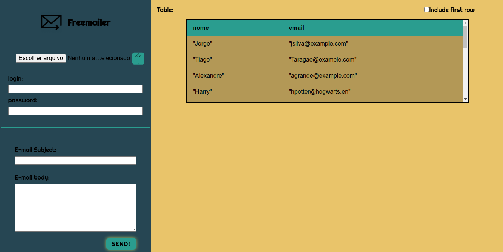

# Freemailer

### ATENÇÃO: AINDA NÃO FUNCIONAL

Estágio de desenvolvimento!

O projeto Freemailer destina-se a automatizar o processo de enviar um e-mail (gmail) à uma lista de endereços eletrônicos, fornecidos ao programa por meio de um arquivo .csv.

Faz-se o upload do arquivo, você faz o login pela plataforma do aplicativo desktop (Não se preocupe, ele é open-source e você pode conferir por si mesmo o código e sua assertada segurança).

PS.: No primeiro envio, por enquanto faz-se necessário permitir por meio da plataforma google o uso de apps terceiros para esse envio de email. Em versões futuras isso será corrigido.
